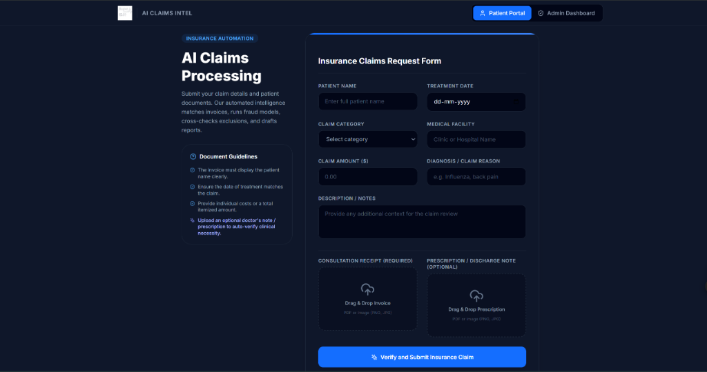
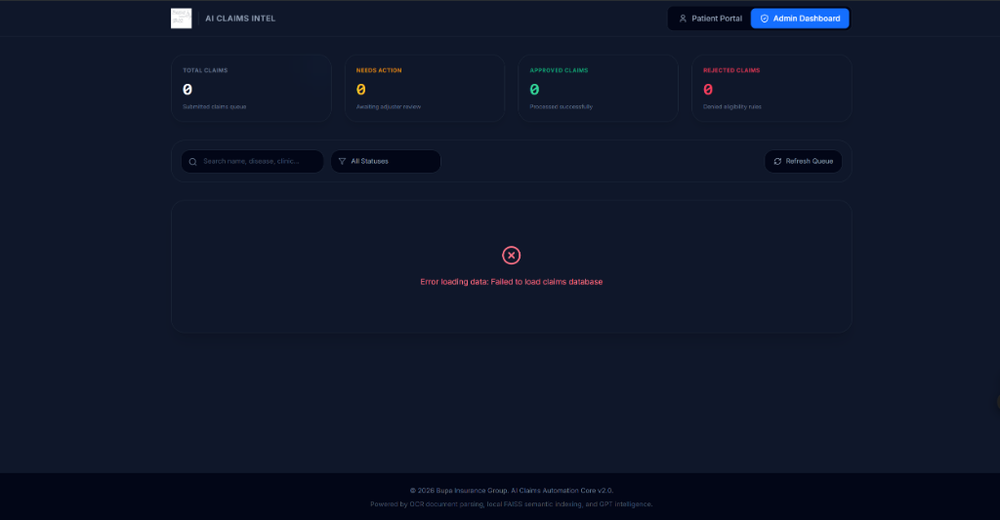
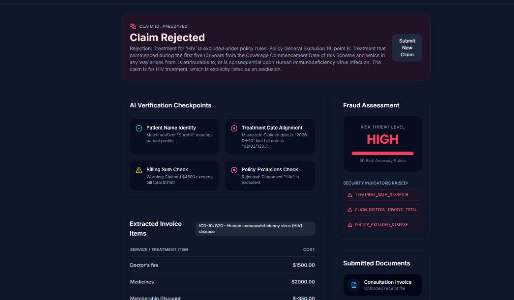
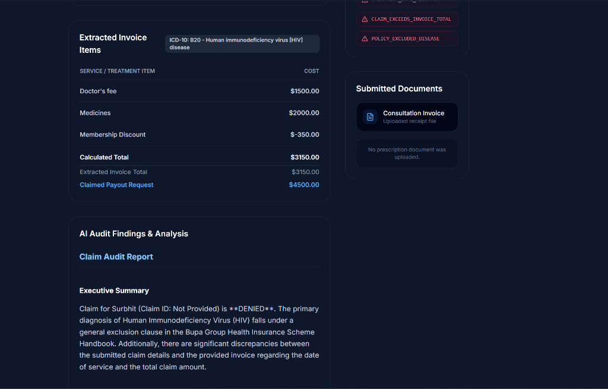

# VeriClaim AI | Claims Processing & Intelligence Portal (ClaimTrackr 2.0)

Efficient and accurate insurance claim processing is vital to customer satisfaction, operational costs, and regulatory compliance. The **VeriClaim AI Claims Intelligence Portal** is a production-grade automated system designed to streamline and audit medical insurance claims. 

By combining **React (Vite)**, **Node.js (Express)**, and **Python (GenAI & OCR Engine)**, this portal automatically reads invoices, extracts itemized bills, maps diagnoses to standard ICD-10 clinical codes, executes policy handbook audits, and detects fraud risk anomalies in seconds.

---

## 🚀 Key Features

### 1. Two-Sided Interactive Web Portal
* **Patient Claimant Portal**: A dark-themed, glassmorphic interface that allows patients to input claim details, upload Consultation Receipts/Invoices, and upload Doctor's Prescriptions. Includes an animated step-by-step progress checklist showing the AI processing path in real time.
* **Adjuster Admin Dashboard**: An operations hub displaying claims metrics grids (Total, Pending, Approved, Rejected), a search/filter toolbar, and an interactive slide-out **Audit Drawer**. Admins can view side-by-side data comparisons (patient input vs OCR extracted data), verify discrepancy flags, read generated AI Markdown reports, and submit final override actions with notes.

### 2. Multi-Model LLM Support (OpenAI + Anthropic Claude)
* **Dual Integration**: The claims engine dynamically selects the reasoning LLM. If `ANTHROPIC_API_KEY` (or `CLAUDE_API_KEY`) is configured in `.env`, the engine utilizes **Claude 3.5 Sonnet** to audit claims. Otherwise, it defaults to **OpenAI GPT-4o-mini**.
* **Smart RAG Fallback**: If the OpenAI API key is unavailable, the system bypasses the OpenAI-dependent FAISS vector database and runs a local fallback reader that extracts text from policy handbooks directly to feed into Claude's 200k context window.

### 3. Image OCR & Scanned PDF Extraction
* **Text Extraction**: Uses `PyPDF2` to read selectable PDF text layers.
* **Scanned PDF Fallback**: If a PDF is a scanned document (image-only), the system uses **PyMuPDF (`fitz`)** to render the PDF pages into high-resolution PNG streams and passes them directly to **EasyOCR** for characters extraction.
* **Image Receipt Uploads**: Native support for direct image uploads (`.png`, `.jpg`, `.jpeg`, `.webp`) processed via CPU-optimized EasyOCR.

### 4. Comprehensive Integrity Checks & Fraud Assessment
* **Fuzzy Name Verification**: Programmatically flags a discrepancy if the patient's name on the medical bill doesn't match the claimant's profile.
* **Treatment Date Check**: Cross-references the treatment date printed on the invoice against the claimed date.
* **Billing Sum Math Check**: Programmatically aggregates extracted line items, comparing the sum to the invoice's declared total and checking if the claimed payout exceeds the bill total.
* **Policy Exclusion Check**: Performs semantic scans to determine if the diagnosis falls under Bupa policy exclusions (e.g. pre-existing conditions, pregnancy, etc.).
* **Prescription Audit**: Verifies whether billed medications or specialized treatments were authorized in the accompanying doctor's prescription.
* **ICD-10 Mapping**: The engine automatically maps the doctor's diagnosis to its standard clinical ICD-10 classification code.
* **Risk Score Anomaly Engine**: Calculates a numeric threat score based on flagged security indicators to assign a risk classification (`LOW`, `MEDIUM`, `HIGH`).

---

## 🛠️ Technology Stack
* **Frontend**: React 18, Vite, Tailwind CSS, Lucide React (Icons)
* **Backend**: Node.js, Express, Multer (file uploads), Dotenv, Child Process Spawn
* **AI & OCR Core**: Python 3.10, PyMuPDF, EasyOCR, PyPDF2, LangChain, FAISS Vector DB, OpenAI API, Anthropic API

---

## 📁 System Directory Layout

```
├── backend/
│   ├── uploads/               # Holds uploaded receipts & prescriptions
│   ├── claim_engine.py        # Core Python claims processing script
│   ├── server.js              # Node.js API endpoints & subprocess spawner
│   ├── package.json           # Node backend dependencies
│   └── claims.json            # Persistence database for audited claims
├── frontend/
│   ├── dist/                  # Compiled production React assets
│   ├── src/
│   │   ├── components/
│   │   │   ├── ClaimForm.jsx  # Patient submission form & audit results
│   │   │   └── AdminDashboard.jsx # Admin review queue & inspection drawer
│   │   ├── App.jsx            # Tab navigation container
│   │   ├── index.css          # Tailwind CSS style overrides
│   │   └── main.jsx           # React DOM root mounting
│   ├── package.json           # React frontend dev packages
│   ├── tailwind.config.js     # Tailwind setup
│   └── index.html             # Application HTML shell
├── documents/                 # Medical Policy handbooks & templates
├── faiss_index/               # Cached vector search databases
├── .env                       # Global environment configuration keys
└── requirements.txt           # Python dependency specifications
```

---

## ⚙️ Setup & Execution Guide

### Prerequisites
1. **Node.js**: Make sure Node.js (v18+) is installed.
2. **Python**: Python 3.10+ installed with a virtual environment or global interpreter.
3. **API Keys**: An OpenAI API key or an Anthropic Claude API key.

---

### Step 1: Configure Environment Variables
Open the `.env` file in the root directory and add your keys:
```env
OPENAI_API_KEY=YOUR_OPENAI_API_KEY_HERE
ANTHROPIC_API_KEY=sk-ant-api03-xxxxxxxxx...
CLAUDE_API_KEY=sk-ant-api03-xxxxxxxxx...
PORT=5000
```
*If only `ANTHROPIC_API_KEY` is provided, the system will use Claude 3.5 Sonnet and automatically run local text-reading fallbacks for policy handbook audits.*

---

### Step 2: Running the Application
The backend Express server serves both the **REST API** and the **compiled production React assets** from a single port (`5000`).

1. Open a terminal in the root directory.
2. Navigate to the `backend/` folder:
   ```bash
   cd backend
   ```
3. Start the server:
   ```bash
   node server.js
   ```
4. Open your web browser and go to:
   **`http://localhost:5000`**

---

### Step 3 (Optional): Active Frontend Development
If you want to edit React components and leverage hot module reloading (HMR):
1. Navigate to the `frontend/` directory:
   ```bash
   cd frontend
   ```
2. Start the Vite development server:
   ```bash
   npm run dev
   ```
3. Open `http://localhost:5173`. Any requests to `/api/*` will automatically proxy to the Express server running on port `5000`.

To build your modifications into the production directory, run:
```bash
npm run build
```
This updates the files in `frontend/dist` which are served by the backend.

---

## 📸 Interface Preview & Screenshots

### 🎥 Live System Demonstration Walkthrough
Watch the automated claim verification, OCR invoice ingestion, policy handbook semantic checks, and the admin adjuster override workflow in action:

<video src="./screenshots/demo_recording.mp4" width="100%" controls></video>

---

### 1. Patient Portal (Claim Request Submission)
The claimant portal allows patient information entry and quick Drag-and-Drop file uploads for receipts and optional prescriptions.


### 2. Admin Adjuster Dashboard
The adjuster queue shows real-time metrics, status filters, and active claims awaiting manual verification or override.


### 3. AI Verification Auditing Checkpoints
The system performs fuzzy identity verification, treatment date matching, mathematical billing sum calculations, and policy exclusion audits in real-time.


### 4. Extended AI Evaluation & Itemized Reports
Displays itemized invoice lines mapped directly to clinical ICD-10 codes, alongside the full markdown evaluation report generated by the Gemini engine.

